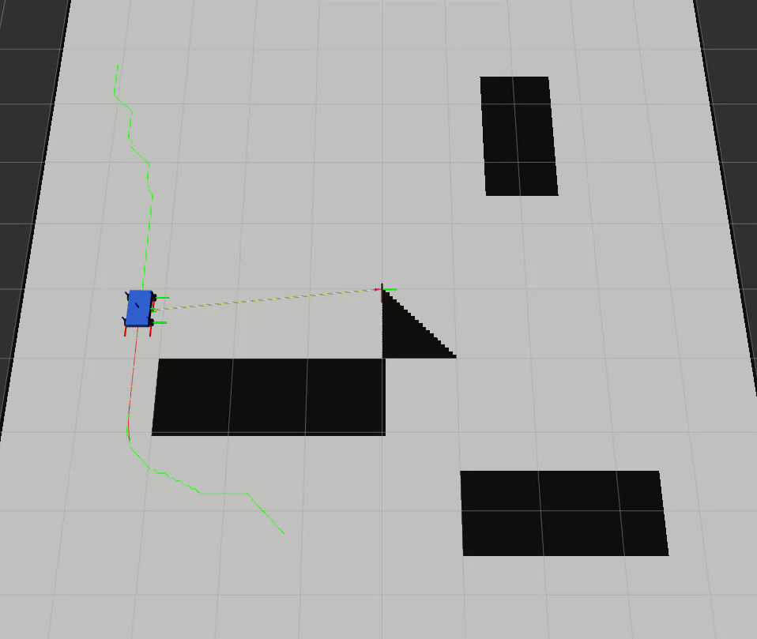
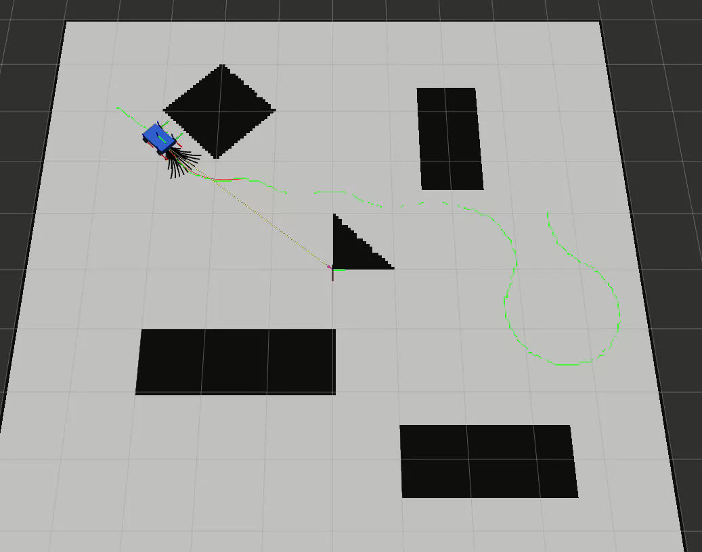
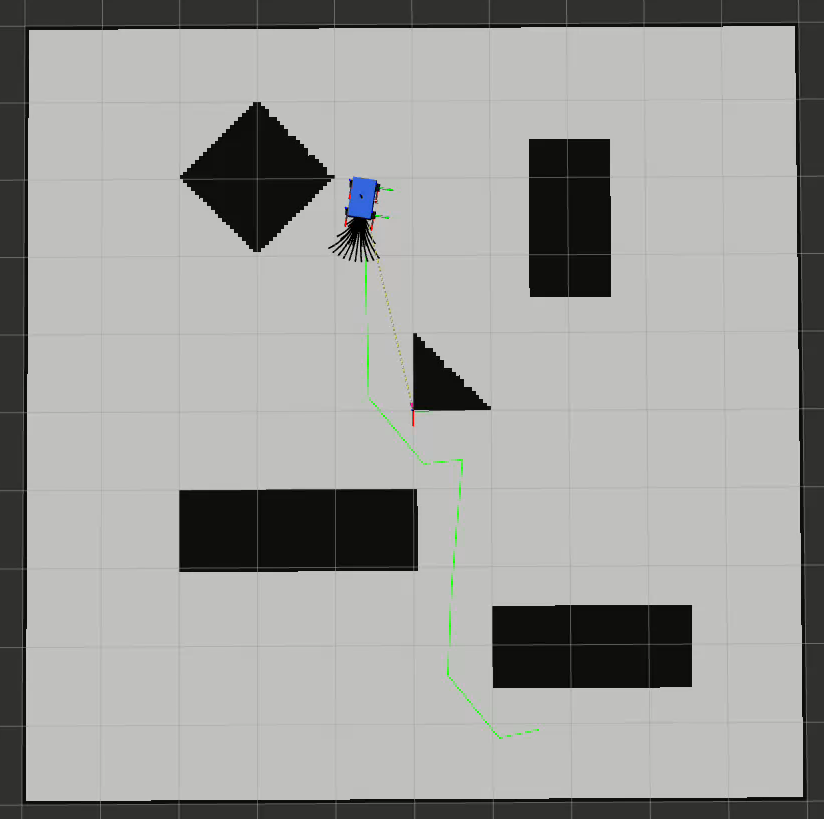
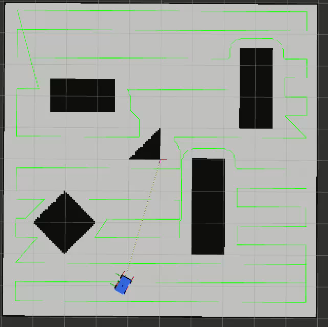
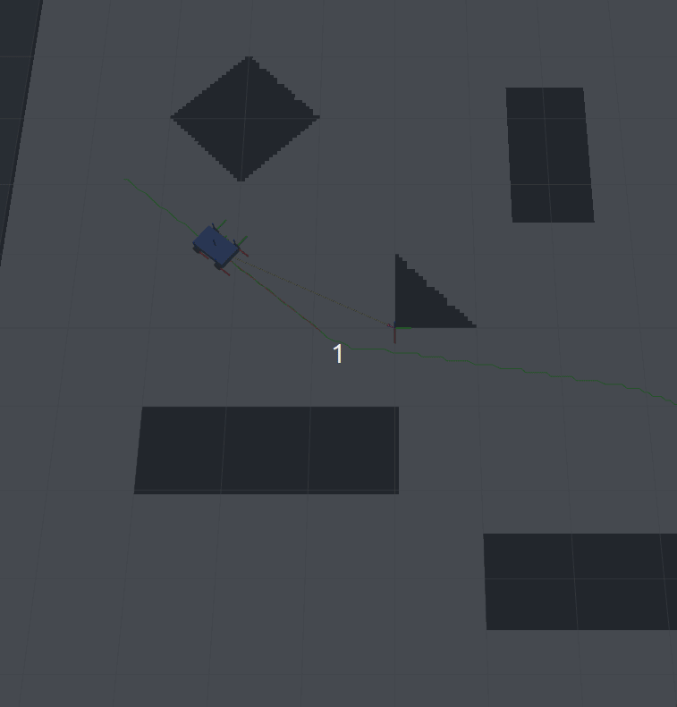
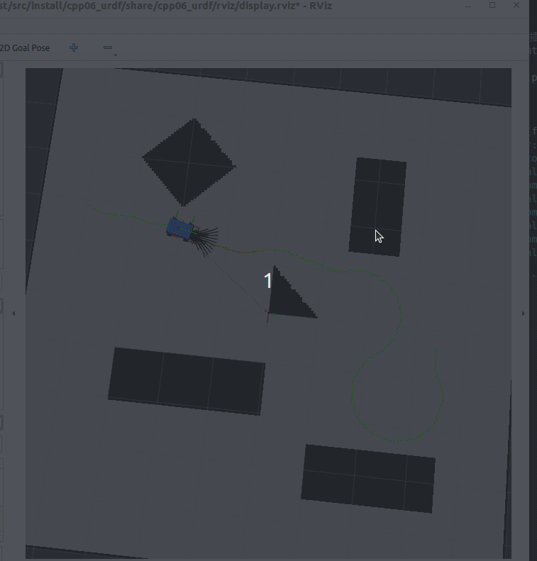
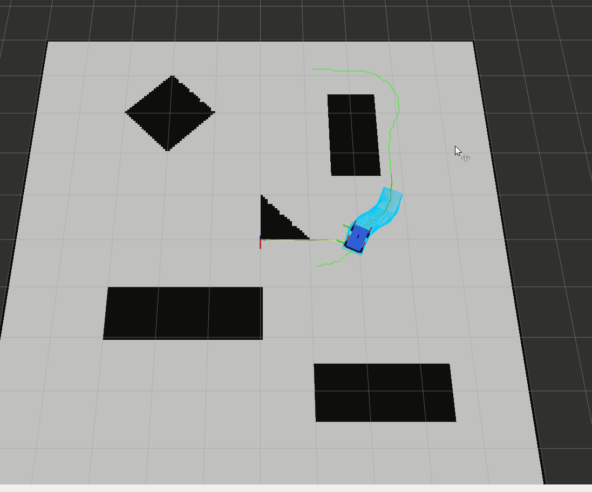
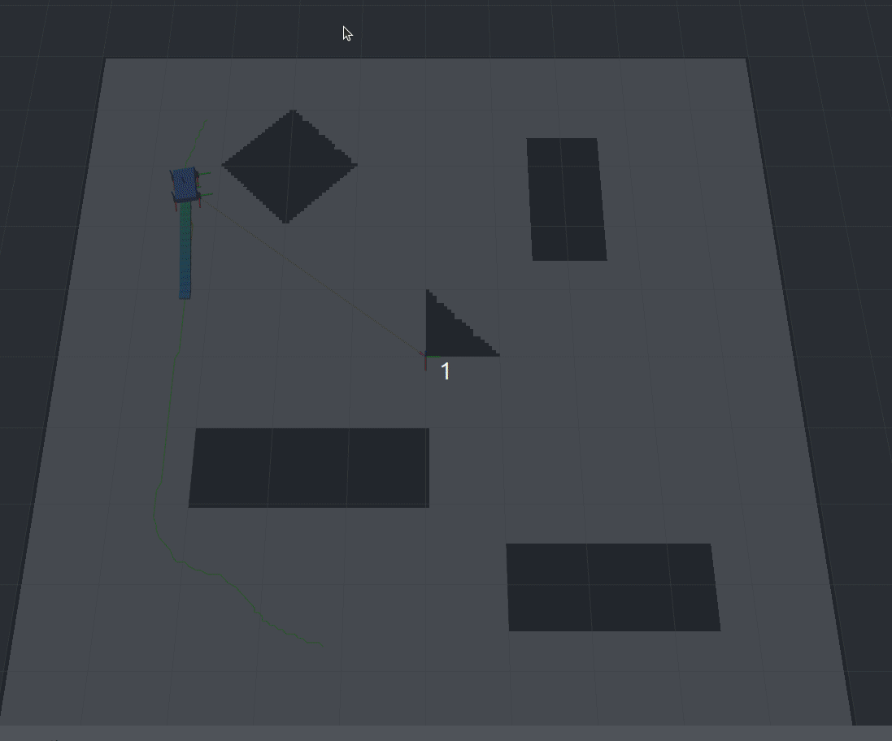

# 规划算法总结

本项目是一个基于 ROS2 的完整路径规划与运动控制框架，代码位于 `cpp06_urdf` 包内，采用"**全局路径规划 → 参考线平滑 → 局部轨迹规划**"三层架构。所有算法均通过工厂模式（`GlobalPlannerFactory` / `ReferenceLineFactory` / `LocalPlannerFactory`）统一创建，可在 `include/common/config.h` 中通过字符串策略切换具体算法。

系统数据流如下：

```
全局路径规划器（global_planner_node）
        │  nav_msgs/Path
        ▼
参考线平滑器（local_planner_node 内）
        │  smoothed local path
        ▼
局部轨迹规划器（local_planner_node）
        │  geometry_msgs/Twist
        ▼
底盘控制（cmd_vel 回传 global_planner_node 仿真 odom）
```

其中 `local_planner_node` 以 50ms 周期运行：先找全局路径上距自车最近点（支持倒车段），裁剪出 2m 局部窗口并插值到 8 点/米，再经参考线平滑，最后交给局部规划器输出速度指令。

---

## 1. 全局路径规划

全局路径规划在已知栅格地图上，从起点位姿到终点位姿搜索出一条满足约束的路径。所有全局规划器继承自 `GlobalPlannerBase`（`include/planner/global_planner/global_planner_base.h`）。

### 1.1 A* 算法



**文件位置**：`src/planner/global_planner/a_star.cpp`、`include/planner/global_planner/a_star.h`

**算法原理**：A* 是栅格地图上的启发式图搜索算法，通过维护 Open 优先队列与 Closed 集合，按代价 `f = g + h` 逐节点扩展。其中 `g` 为起点到当前节点的实际代价，`h` 为当前节点到目标点的欧几里得距离（可采纳启发，保证最优性）。

**实现过程**：
1. 将起点、终点从世界坐标转换到栅格坐标，检查是否越界、是否落在障碍物（占据值 ≥ 50）上；
2. 以 8 邻域方式扩展节点，直线移动代价为 `resolution`，对角线为 `resolution * sqrt(2)`；
3. 扩展时调用 `hasObstacleInRadius` 检查节点附近 `a_star_obstacle_gap`（0.3m）半径内是否存在障碍物，保证路径与障碍物保持安全距离；
4. 每个节点记录 `came_from` 父指针，搜索到终点后回溯得到路径，转换为 `nav_msgs::msg::Path` 发布。

**特点**：完备且最优；但输出为折线、未考虑车辆朝向约束，需要后续平滑。

### 1.2 Hybrid A* 算法（含 Dubins / Reeds-Shepp shot）



**文件位置**：`src/planner/global_planner/hybrid_a_star.cpp`、`include/planner/global_planner/hybrid_a_star.h`

**算法原理**：Hybrid A* 将 A* 的搜索状态从二维栅格 `(x, y)` 扩展为 `(x, y, theta)`，朝向按 `constants::headings = 72` 等分（每 5° 一档）。后继节点由车辆运动学原语（前进左/直/右，可选倒车三原语）生成，因此搜索出的路径天然满足非完整约束。启发函数取 Dubins 距离与 Reeds-Shepp 距离的较大值，提供紧致的可采纳下界，大幅加速搜索。

**实现过程**：
1. 将起点/终点位姿转换到栅格坐标并归一化 yaw，初始化 `Node3D`；
2. 用优先队列按 `f = g + h` 弹出节点，`updateH` 通过 OMPL 的 `DubinsStateSpace` / `ReedsSheppStateSpace` 计算启发代价；
3. 每次扩展按原语生成后继（`createSuccessor`，转弯/倒车/换向分别乘 `penaltyTurning` / `penaltyReversing` / `penaltyCOD` 代价），做碰撞检测后入队；
4. 当节点进入目标点 `dubinsShotDistance`（20）范围内时，触发解析解 shot：`dubinsShot` 使用本项目自实现的 Dubins 曲线（`dubins.cpp`），`reedSheppShot` 使用 OMPL 实现的 Reeds-Shepp 曲线，按 `dubinsStepSize` 步长采样并逐点碰撞检测，成功则直接连接目标；
5. 沿前驱指针回溯得到带朝向的路径。

**特点**：输出路径可直接被车辆执行，适合泊车与狭窄环境；状态空间维度高，计算量大于 A*。

### 1.3 RRT* 算法



**文件位置**：`src/planner/global_planner/rrt_star.cpp`、`include/planner/global_planner/rrt_star.h`

**算法原理**：RRT* 是基于随机采样的渐进最优算法。与 RRT 相比，新节点接入树时在搜索半径内选择使总代价最小的父节点（`chooseParent`），并通过 `rewire` 操作尝试将新节点作为邻域内其他节点的更优父节点，从而逐步降低路径代价。

**实现过程**：
1. 采样空间为整个栅格地图，`dis_x_/dis_y_` 均匀分布采样随机点，`goal_bias_rate_`（5%）概率直接采样目标点加速收敛；
2. `findNearestNode` 线性扫描树找最近节点，`generateNewNode` 沿最近点指向随机点的方向以 `extend_length_` 步长延伸出新节点；
3. 碰撞检测通过 `CollisionDetection::isTraversable` 与 `isLineCollision`（按弧长 1 步进采样线段）双重校验；
4. `chooseParent` 在 `search_radius_` 内选最优父节点，`rewire` 更新邻域节点父指针，二者均附带线段碰撞检查；
5. 迭代 `iteration_` 次，`goal_tolerance_` 判断到达目标；迭代结束若未直接命中，则在树中选距离目标最近的节点回溯路径。

**特点**：高维/复杂环境扩展能力强；路径质量依赖迭代次数与参数，实时性弱于搜索类算法。

### 1.4 Dubins 曲线

**文件位置**：`src/planner/global_planner/dubins.cpp`、`include/planner/global_planner/dubins.h`

**算法原理**：Dubins 曲线描述在最小转弯半径 `rho` 约束下、不允许倒车时两个位姿之间的最短路径。最短路径由三段组成（L 左转 / S 直行 / R 右转），共 6 种基本类型：LSL、LSR、RSL、RSR、LRL、RLR。

**实现过程**：
1. `dubins_init` 将起点/终点归一化为标准形式（`alpha, beta, d`），依次调用 6 种类型的解析求解函数（`dubins_LSL` 等）；
2. 比较各类型三段弧长总和，选总长最短的合法路径；
3. `dubins_path_sample` 支持按弧长 `t` 采样路径上的位姿，供 shot 连接与轨迹离散化使用。

**用途**：作为 Hybrid A* 的 shot 策略、航向插值与路径平滑。

### 1.5 Reeds-Shepp 曲线

**文件位置**：`src/planner/global_planner/reed_shepp.cpp`、`include/planner/global_planner/reed_shepp.h`

**算法原理**：Reeds-Shepp 曲线是 Dubins 曲线的推广，允许倒车行驶，其最短路径至多 5 段，由左转、直行、右转以及前进/后退方向组合而成，狭窄空间中路径比 Dubins 更短。

**实现过程**：
1. 基于 OMPL 的 `ReedsSheppStateSpace::reedsShepp` 计算最优路径；
2. 将 OMPL 的段类型映射为本地枚举（0 左转、1 直行、2 右转），`param[i]` 保存带符号段长（正=前进、负=后退）；
3. `reeds_shepp_path_sample` 按弧长采样，根据段类型用几何公式递推位姿，并对角度归一化。

**用途**：倒车泊车、狭窄空间掉头；Hybrid A* 倒车模式下的 shot 连接。

### 1.6 完全覆盖路径规划（BCD + Sweep + TSP）



**文件位置**：`src/planner/global_planner/complete_cover_path/bcd.cpp`、`sweep.cpp`、`boundary_path.cpp`；入口在 `global_planner_base.cpp` 的 `generateCompleteCoverPath`

**算法原理**：完全覆盖路径规划让机器人遍历区域内所有可达位置（扫地、巡检、农业等场景）。整体分三步：**Boustrophedon Cell Decomposition（BCD）** 沿扫描方向把含障碍物的多边形区域分解成若干单元；**Sweep 牛耕法** 在每个单元内生成平行扫描线形成蛇形路径；**TSP 排序** 优化各单元访问顺序与入口方向。

**实现过程**：
1. **BCD 分解**（`bcd.cpp`）：将边界与障碍物多边形按扫描方向旋转，对顶点排序后按事件（IN/OUT/MIDDLE）扫描。维护活动边表 `L` 与开放多边形列表 `open_polygons`：IN 事件新开单元，OUT 事件闭合单元，MIDDLE 事件更新边并给单元补充顶点；`cleanupPolygon` 清理重复点与共线点，最终输出 `closed_polygons` 单元集合；
2. **Sweep 扫描**（`sweep.cpp`）：对每个单元沿扫描方向法向以 `offset` 为间距生成扫描线，求扫描线与单元各边的交点，每两个交点构成内部扫描线段（沿扫描方向收缩 0.4 障碍物间隙）；相邻扫描线交替正向/反向遍历（蛇形），行尾到下一行行首直接相连；
3. **TSP 排序**（`bcd.cpp` 的 `generateGlobalCoverPath`）：为每个单元预生成正向/反向两条局部路径，状态压缩 DP 状态为 `(mask, last, orientation)`，转移代价为上一单元出口到下一单元入口的距离，回溯得到全局最优访问顺序；相邻单元之间若提供地图则用 A* 搜索连接路径；
4. `generateCompleteCoverPath` 再调用子类全局规划器（如 Hybrid A*）规划自车位置到覆盖起点的接近路径并拼接。

**边界路径**（`boundary_path.cpp`）：沿障碍物多边形外扩 offset 得到内缩多边形（含斜接限幅），转角处用圆弧平滑（`appendCornerArc`，切线段长自适应缩限），多障碍物间用最近邻贪心排序拼接。

**特点**：可完成复杂边界带障碍区域的全覆盖；BCD 与 TSP 计算量随单元数增长，适合离线规划。

---

## 2. 参考线平滑

参考线平滑对全局规划器输出的粗糙路径做后处理，使曲率连续、更适合车辆跟踪。所有平滑器继承自 `ReferenceLineBase`，通过 `ReferenceLineFactory` 创建。

### 2.1 三次 B 样条（B-Spline）

**文件位置**：`src/planner/reference_line/b_spline.cpp`

**算法原理**：B 样条是分段多项式参数曲线，具有局部支撑性与高阶连续性。本项目使用三次（p=3）B 样条对路径点进行插值平滑。

**实现过程**：
1. `buildKNot` 生成节点向量：type=1 为均匀节点向量，type=2 为准均匀（两端重节点，曲线过首末控制点）；
2. `bsplineBaseFunc` 用 Cox-de Boor 递推公式计算基函数；
3. 在参数区间 `[0, 1]` 上以 `interval_ = 0.01` 步长采样，加权累加得到密集平滑路径；
4. 逐点根据相邻点计算切线方向写入朝向四元数。

**特点**：平滑度高、曲率连续；可能偏离原始路径点，倒车场景朝向需额外处理。

### 2.2 滑动窗口均值（Slide Window）

**文件位置**：`src/planner/reference_line/slide_window.cpp`

**算法原理**：对每个路径点取前后窗口内所有点的坐标均值作为新坐标，是最简单有效的滤波式平滑。

**实现过程**：
1. 窗口大小固定为 5（前后各 2 点），起点/终点只用有效范围内的点求均值；
2. **保留原始路径朝向**，不按切线重算 yaw——这对包含倒车段的路径（车头朝向与切线相反）至关重要，否则会误导控制器。

**特点**：实现简单、计算快、保留朝向；平滑能力有限，不增加路径点。

### 2.3 三阶贝塞尔曲线（Bezier）

**文件位置**：`src/planner/reference_line/bezier.cpp`

**算法原理**：贝塞尔曲线由控制点定义参数曲线。本项目实现三阶贝塞尔（`k_ = 3`），并保证相邻段之间位置与速度（C1）连续。

**实现过程**：
1. 首段由原始点 `w0, w1` 构造控制点：`p1 = w0 + scale*(w1-w0)`、`p2 = w1 - scale*(w1-w0)`；
2. 后续段控制点 `p1 = 2*A2 - A1`（A2、A1 为上一段末两个输出点），实现与前段终点的 C1 连续，`p2 = w1 - scale*(w1-w0)`；
3. 输出每段 `[p1, p2, w1]` 三个点，最后按相邻点重算朝向。

**特点**：曲线光滑、控制简单；仅支持三阶，长路径控制点链可能偏离原始路径。

---

## 3. 局部轨迹规划

局部轨迹规划器根据当前车辆状态与平滑后的局部参考线，实时输出速度/角速度指令。所有局部规划器继承自 `LocalPlannerBase`，通过 `LocalPlannerFactory` 创建。

### 3.1 Pure Pursuit（纯跟踪）



**文件位置**：`src/planner/local_planner/pure_pursuit.cpp`

**算法原理**：经典的几何跟踪算法。在参考路径上寻找距车辆超过前视距离 `lookaheadDistance`（0.6m）的第一个点作为目标点，车辆绕目标点做圆弧运动，曲率由纯几何关系 `κ = 2·sin(α) / L` 给出（α 为目标点相对车头朝向的夹角，L 为前视距离）。

**实现过程**：
1. 遍历平滑后的局部路径，找第一个距离超过前视距离的点；找不到则取路径终点；
2. 计算目标点相对车辆的夹角 α 并归一化到 `[-π, π]`；
3. 速度 `v = maxLinearSpeed * max(0, cos(α))`，大角度时自动减速（下限 0.05）；
4. 角速度 `omega = v * κ`，按 `maxAngularSpeed` 限幅后输出。

**特点**：实现简单、参数少、鲁棒；固定前视距离难以同时兼顾直线高速与弯道跟踪。

### 3.2 DWA（动态窗口法）



**文件位置**：`src/planner/local_planner/dwa.cpp`

**算法原理**：DWA 在差速车辆的速度空间 `(v, ω)` 中离散采样，对每组控制量用差速运动学模型前向仿真短时轨迹，再用多项加权代价函数评估，选代价最小的控制量。

**实现过程**：
1. **动态窗口**：由当前速度 ± 最大加减速度 × dt 与速度上下限共同确定采样窗口（支持倒车时 v 下限为 `-max_v`）；
2. **采样仿真**：以 `v_resolution_`（0.1）与 `omega_resolution_`（0.1）步长遍历采样，`predictTrajectory` 用差速模型 `x_{k+1} = x_k + r·(sin(θ+ωdt) − sinθ)` 等公式前向仿真 `sim_step_`（2.0s / 0.1s = 20）步；
3. **安全性检查** `isSafe`：轨迹每点到所有多边形障碍物求最小距离；距离过近直接剔除，并按最大减速度 `v_limit = sqrt(2·d·a_max)` 约束当前速度档位；
4. **代价函数**四项加权：`heading_cost`（终点朝向与目标朝向偏差 × 速度比例）、`vel_cost`（鼓励高速）、`obstacle_cost`（与障碍物最小距离成反比）、`dist_cost`（轨迹点到参考线最近距离累计）；
5. 输出最优 `(v, ω)`，并可视化所有采样轨迹（最优轨迹绿色高亮）。

**特点**：实时性好、可处理动态障碍物、适合差速车；采样分辨率影响最优性，高速大曲率场景受限。

### 3.3 MPC（模型预测控制）



**文件位置**：`src/planner/local_planner/mpc.cpp`；详细推导见 `docs/mpc_osqp_guide.md`

**算法原理**：MPC 基于差速车辆运动学模型（状态 `x = [x, y, θ]`，控制 `u = [v, ω]`），在预测时域内围绕参考轨迹线性化，将跟踪问题转化为二次规划（QP）求解，显式满足动力学与边界约束。

**实现过程**：
1. **参考轨迹重建** `rebuildReferenceFromEgo`：把自车位姿投影到参考线最近点，拼接"自车 → 投影点 → 剩余路径"，端点固定做 3 轮窗口均值平滑，保证首段与自车状态一致；
2. **按弧长重采样** `resamplePath`：以 `v_ref · dt`（0.3×0.05）步长在预测时域 N=20 内插值出参考状态 `x_ref`，再由差分计算参考控制量 `u_ref`；
3. **线性化**：`x_{k+1} = A_k x_k + B_k u_k`，其中 `A(0,2) = -dt·v·sinθ`、`A(1,2) = dt·v·cosθ`、`B` 为差速运动学 Jacobian；
4. **构造 QP**：优化变量为状态增量与控制增量（围绕参考轨迹），Hessian 由权重 `Q = diag(500,500,50)`、`R = diag(10,5)`、终端 `P = Q` 组成；约束包含初始状态等式、N 步动力学等式、状态/控制上下界（v ∈ [-0.2, 0.6]，ω ∈ [-1.8, 1.8]）；
5. **OSQP 求解**：首帧 `initSolver` 后每帧 `update*` 热启动更新矩阵与边界；求解失败时回退到参考控制量 `u_ref[0]`，连续失败达阈值则重建求解器，避免急停；
6. 提取首步控制增量 `u_ref[0] + δu0` 二次限幅输出，同时保存前向仿真预测轨迹用于可视化（每隔一步画车辆包围盒）。

**特点**：显式处理约束、跟踪精度高、具有预测能力；计算量较大，依赖参考轨迹质量，弯道线性化误差较明显。

### 3.4 TEB（时间弹性带）



**文件位置**：`src/planner/local_planner/teb.cpp`、`include/planner/local_planner/teb_types/`

**算法原理**：TEB 把局部轨迹视为一条在障碍物间具有弹性的"带"，同时优化带上一系列位姿顶点 `(x, y, θ)` 与相邻位姿间的时间差 `dt`，通过图优化（g2o）使轨迹同时满足运动学约束、速度/加速度约束、障碍物距离约束、平滑性与时间最优性。

**实现过程**：
1. **初始化轨迹** `initTrajectory`：以当前位姿为固定起点、参考线末点为固定终点，中间点逐点插入（`estimate_orient` 时朝向取相邻点方向），`estimateDeltaT` 按最大线速度/角速度估计每段时间差；点数不足 `min_samples` 时在尾段插值补齐；
2. **热启动** `updateAndPruneTEB`：目标点变化不大时复用上帧轨迹——裁剪已走过段、更新起点/终点、把中间位姿吸附到当前参考线最近点（窗口搜索加速），否则重新初始化；
3. **自动重采样** `autoResize`：遍历时间差，超过 `dt_ref + dt_hysteresis` 则在中间插入平均位姿并平分时间，小于 `dt_ref - dt_hysteresis` 则删除位姿合并时间；
4. **构建 g2o 超图** `buildGraph`：顶点为 `VertexPose` 与 `VertexTimeDiff`；边包括障碍物边 `EdgeObstacle`（按左右侧关联最近障碍物，配合 `CircularRobotFootprintModel` 计算距离）、速度约束边 `EdgeVelocity`、加速度约束边 `EdgeAcceleration`（含带初速度的 Start/Goal 变体）、时间最优边 `EdgeTimeOptimal`、最短路径边 `EdgeShortestPath`、差速运动学边 `EdgeKinematicsDiffDrive`、转向偏好边 `EdgePreferRotDir` 及障碍物减速比边 `EdgeVelocityObstacleRatio`；每条边设置对应信息矩阵权重；
5. **迭代优化** `optimizeTEB`：外层循环自动重采样、建图、LM 优化内层循环，每轮将障碍物权重乘以 `weight_adapt_factor` 递增，逐轮强化避障约束；
6. **速度提取** `getVelocityCommand`：从优化后的前若干位姿与时间差计算 `v = ΔS/dt`（投影到起点朝向，支持倒车）与 `ω = Δθ/dt` 输出。

**特点**：同时优化空间轨迹与时间分配，适合狭窄通道与动态避障；支持热启动保证实时性，图规模随位姿数增长。

---

## 4. 总结

| 层级 | 算法 | 核心能力 | 典型用途 |
|------|------|----------|----------|
| 全局规划 | A* / Hybrid A* / RRT* | 起终点路径搜索 | 导航、泊车 |
| 全局规划 | Dubins / Reeds-Shepp | 满足非完整约束的最短曲线 | shot 连接、航向插值 |
| 全局规划 | BCD + Sweep + TSP / 边界路径 | 区域全覆盖 / 贴边路径 | 清扫、巡检 |
| 参考线平滑 | B-Spline / Slide Window / Bezier | 路径光滑与朝向处理 | 为控制器提供可跟踪参考线 |
| 局部规划 | Pure Pursuit / DWA / MPC / TEB | 实时跟踪与避障 | 车辆底层控制 |

用户可在 `include/common/config.h` 中通过 `global_path_strategy`、`reference_line_strategy`、`local_path_strategy` 三个开关灵活组合各层算法，通过 `enable_cover_path` / `enable_edge_path` 切换全覆盖与贴边模式。
